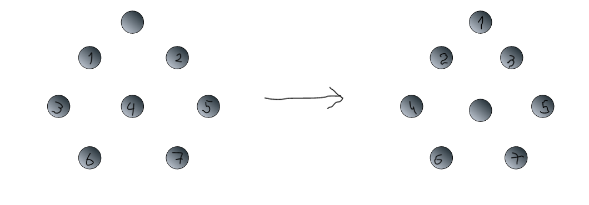

# Puzzle


### The point of ...

Find the least number of moves.



### How to use

```sh
$ git clone ...
$ cd project
$ ./gradlew build
$ jar tf ./build/libs/org.naumen.jar
META-INF/
META-INF/MANIFEST.MF
org/
org/naumen/
org/naumen/PuzzleResolver.class
org/naumen/Node.class
org/naumen/Puzzle.class
```

**target - project/build/libs/org.naumen.jar**

```java
import org.naumen.Puzzle;

...

Puzzle puz = new Puzzle();
int[] moves = puz.resolve(new int[] { 0, 1, 2, 3, 4, 5, 6, 7 });
```